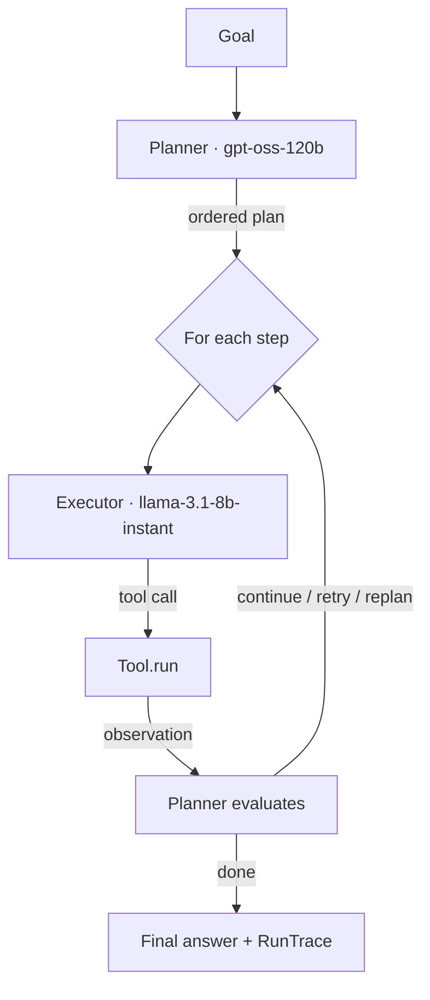

# multi-agent-orchestrator

A multi-agent task orchestrator that turns a natural-language goal into actions through a
**plan → execute → observe → re-plan** loop. A **planner** agent decomposes the goal and
decides what to do after each step; an **executor** agent carries each step out by calling
tools. It runs entirely on **Groq's free tier** today, behind a **provider-agnostic LLM
interface** so any provider — including Anthropic — can be dropped in with zero orchestrator
changes (*"Anthropic-ready"*).

> Smart planner model + fast executor model, both on Groq's free tier, behind a
> provider-agnostic interface, with schema-driven tool calling, a re-planning loop, and
> rate-limit-aware retry/backoff — running entirely on free-tier infrastructure.


## Architecture



- **Planner** (larger model): `make_plan` → ordered steps; `decide` → `continue` / `retry` /
  `replan` / `done` after each observation; `finalize` → synthesized answer.
- **Executor** (small, fast model): turns one step into a single validated tool call.
- **Tool registry**: schema-driven tools (Pydantic `Args` → JSON Schema), validated dispatch,
  graceful handling of unknown/invalid calls.
- **Provider layer**: one `LLMProvider` interface; `GroqProvider` wired by default,
  `AnthropicProvider` interface-complete and activated only when a key is present.

### Why this design

- **Provider-agnostic, not provider-coupled.** The orchestrator never imports a provider
  SDK — only the `LLMProvider` interface. Groq runs it free today; an `ANTHROPIC_API_KEY`
  enables the Anthropic backend with no code changes. Designing for extensibility is a
  stronger signal than hardcoding two providers.
- **Built for the real constraint: tokens-per-minute.** On the free tier, TPM (not
  requests-per-minute) is what bites a multi-step agent. Every provider call goes through
  retry/backoff that honors `429` + `retry-after`; the loop paces against a token budget; and
  system prompts are kept stable so Groq's automatic prefix caching applies — cached tokens
  don't count toward TPM and cost 50% less.

## Quickstart

```bash
git clone https://github.com/natan497/multi-agent-orchestrator
cd multi-agent-orchestrator
python -m venv .venv && source .venv/bin/activate   # Windows: .venv\Scripts\activate
pip install -e ".[dev]"

cp .env.example .env        # add a free key from https://console.groq.com
python examples/demo_tasks.py
```

The only credential needed is a free `GROQ_API_KEY`. All built-in tools are keyless.

## Built-in tools

| Tool | Key | Purpose |
|------|-----|---------|
| `calculator` | none | Safe arithmetic via an `ast` allowlist (no `eval`). |
| `weather` | none | Current conditions via Open-Meteo (geocode + forecast). |
| `wikipedia_search` | none | Top Wikipedia result: title, description, excerpt. |
| `http_request` | none | Generic GET/POST with an SSRF guard and timeout. |

Add your own by subclassing `Tool` (set `name`, `description`, a Pydantic `Args` model, and
implement `run`) and registering it.

## Example trace

```
────────────── What is 1234 * 5678, and is it greater than five million? ──────────────
  📋 plan: compute 1234 * 5678 → compare the result to 5,000,000
  🔧 tool_call: calculator({'expression': '1234 * 5678'})
  👁 observation: 7006652
  ⚖ decision: continue
  💬 executor_text: 7,006,652 is greater than 5,000,000.
  ⚖ decision: done
╭──────────────────────────── Result ────────────────────────────╮
│ 1234 * 5678 = 7,006,652, which is greater than five million.    │
│                                                                 │
│ success · 2 iterations · 1 tool calls · 812 in / 96 out tokens  │
╰─────────────────────────────────────────────────────────────────╯
```

See the [demo GIF](#multi-agent-orchestrator) above for a full live run.

## Evals

A small harness runs fixed tasks with expected outcomes and reports pass/fail, tool calls,
and token usage, with token-budget guarding for the free tier:

```bash
python examples/eval_harness.py
```

It streams each case as it runs and prints a summary table at the end. The cases run
sequentially with ~2s pacing between them, so a full run takes roughly **1–4 minutes** on
the free tier (longer cases involve multiple tool calls and the occasional retry). Pass
rates vary run-to-run because the free models are non-deterministic — it's a smoke/quality
signal, not a strict grader.

## Configuration

Set in `.env` (see `.env.example`):

| Var | Default | Notes |
|-----|---------|-------|
| `GROQ_API_KEY` | — | Required. |
| `ANTHROPIC_API_KEY` | — | Optional; enables the Anthropic backend when set. |
| `LLM_PROVIDER` | `groq` | `groq` or `anthropic`. |
| `PLANNER_MODEL` | `openai/gpt-oss-120b` | Larger reasoning model. |
| `EXECUTOR_MODEL` | `llama-3.1-8b-instant` | Fast tool-calling model. |
| `MAX_ITERATIONS` / `MAX_TOOL_CALLS` / `MAX_RETRIES_PER_STEP` | `10` / `20` / `2` | Guardrails. |

> **Tip:** the small default executor (`llama-3.1-8b-instant`) occasionally emits a malformed
> tool call that Groq rejects (`tool_use_failed`); the orchestrator retries and recovers
> automatically. For even more reliable tool calling at higher token cost, set
> `EXECUTOR_MODEL=llama-3.3-70b-versatile`.

## Development

```bash
pytest                              # unit tests (fully mocked; no API key needed)
pytest -m live                      # opt-in live tests against real Open-Meteo + Wikipedia
GROQ_API_KEY=... pytest -m live tests/test_live_groq.py   # live Groq smoke (chat, tool call, full loop)
ruff check src tests examples
ruff format src tests examples
```

Live tests are skipped unless explicitly selected; the Groq smoke tests additionally skip
when `GROQ_API_KEY` is unset, so the default suite stays green with no credentials.

```
src/orchestrator/   models, config, planner, executor, state, orchestrator
src/providers/      base (LLMProvider) + groq, anthropic
src/tools/          base, registry, builtins/
examples/           demo_tasks.py, eval_harness.py
tests/              one module per source module (fully mocked)
```

See [SPEC.md](SPEC.md) for the full specification and [CLAUDE.md](CLAUDE.md) for build rules.
